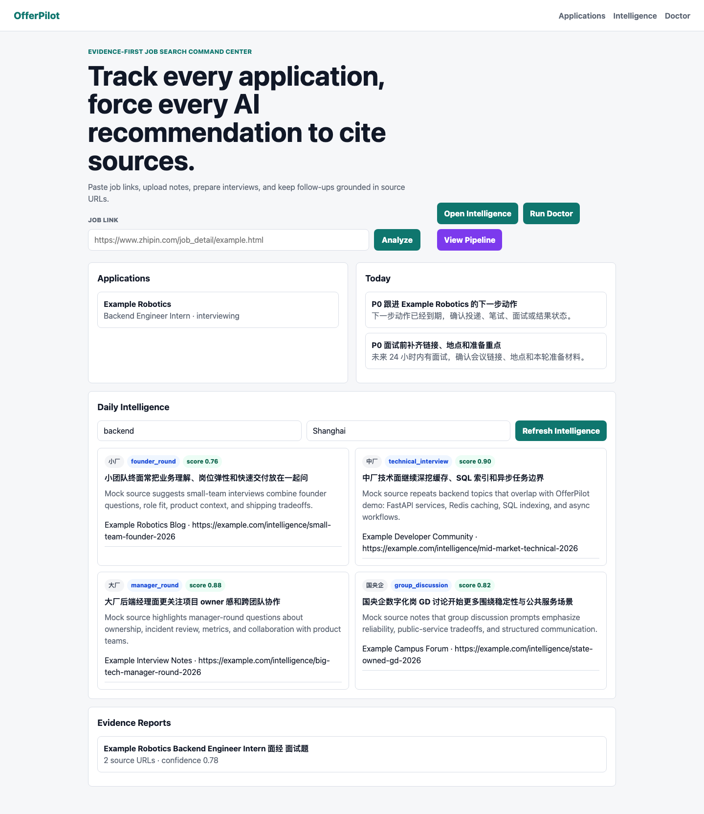
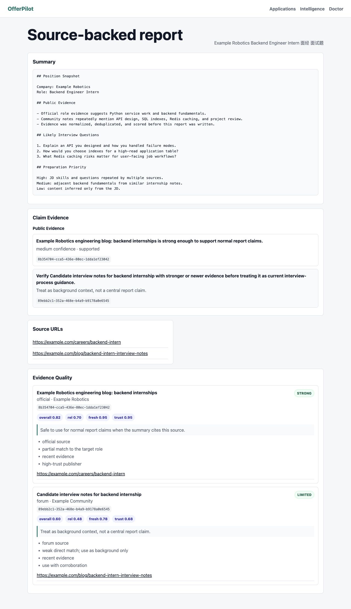
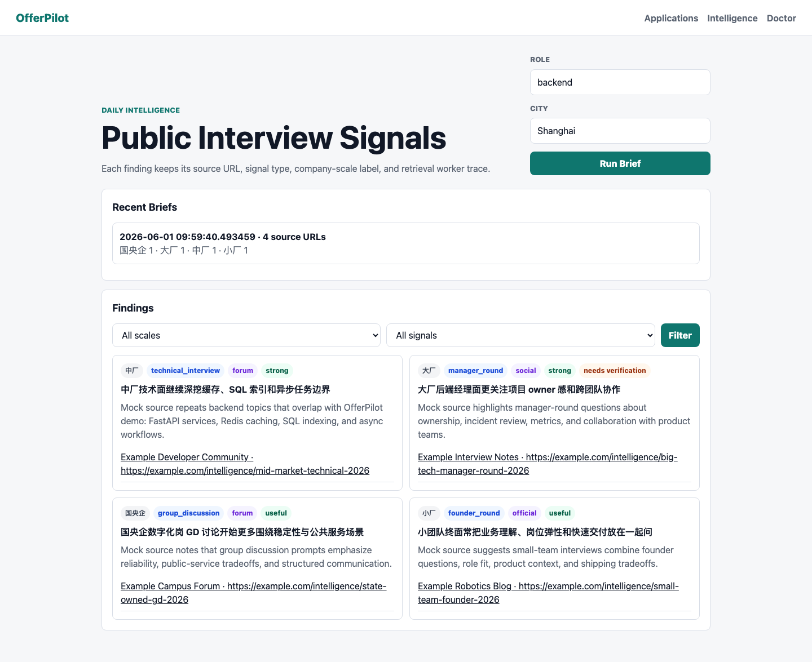
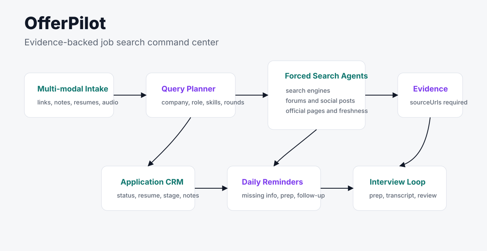

# OfferPilot

[](https://github.com/Lling0000/awesome-OfferPilot/releases)
[](LICENSE)
[](https://www.python.org/)

Evidence-backed job search tracking and interview preparation for modern applicants.

Paste a job link, paste a full JD, upload a resume, or drop an interview note. OfferPilot turns scattered job-search context into an application pipeline, daily follow-ups, interview prep, and reports that keep every AI-generated recommendation tied to source URLs.



## Why OfferPilot?

Job searching is not just a spreadsheet problem. Every application creates scattered context: job links, recruiter messages, resume versions, interview notes, company research, follow-ups, and forgotten feedback.

OfferPilot keeps that context in one place and forces every generated interview-prep report to cite evidence. If a report has no `sourceUrls`, it is not a completed report.

## What It Does

- Track applications, resumes, interviews, follow-ups, and outcomes.
- Parse job links or pasted JDs and turn them into structured opportunities.
- Plan privacy-aware search queries from each job lead.
- Generate interview prep with mandatory evidence links and source scores.
- Normalize, deduplicate, and score public sources before analysis.
- Store `sourceUrls` beside every report and source-backed recommendation.
- Run a daily mock-backed interview intelligence brief across 国央企、大厂、中厂、小厂 signals.
- Upload interview recordings or paste typed notes, then store transcript-backed summaries, questions, and next-focus items.
- Remind users daily to fill only the information that changes their next action.
- Run locally without API keys through deterministic mock agents.

## Quick Start

```bash
python3 -m venv .venv
source .venv/bin/activate
python3 -m pip install -e ".[dev]"
offerpilot demo --reset
offerpilot serve --host 127.0.0.1 --port 8000
```

Open `http://127.0.0.1:8000`.

`offerpilot serve` is a long-running local server command; keep that terminal open while you use the web app. For a copy-paste two-terminal smoke path with expected UI outcomes, use [docs/demo-script.md](docs/demo-script.md).

## Try The Extension Model

After the demo runs, inspect [docs/adapters.md](docs/adapters.md) and run the minimal search-source plugin:

```bash
python examples/search-source-plugin/run_example.py
```

`SearchSource` is the best first contribution path today because it can add a real source without changing the rest of the application pipeline. For live providers, start from `ExternalSearchAPISource`; it checks credentials and endpoint setup before any transport can return linked candidates.

## Verify The Project

```bash
offerpilot doctor
offerpilot doctor --strict-publish
pytest
ruff check .
```

`doctor --strict-publish` checks the repo-facing pieces that make OfferPilot feel real: docs, examples, license, database schema, and the `sourceUrls` report constraint.

Adapter authors can start with [docs/adapters.md](docs/adapters.md) and the runnable [search source plugin example](examples/search-source-plugin).

Before publishing or sharing the repo, run through [docs/launch-checklist.md](docs/launch-checklist.md). For contributor-facing scope, good first issues, acceptance criteria, and non-goals, see [docs/roadmap.md](docs/roadmap.md).

## Product Screenshots

Source-backed report:



Daily intelligence:



## Demo Flow

The built-in demo creates:

- one demo applicant,
- one backend internship resume,
- one Boss-style job link,
- one application in the interview stage,
- one forced-search report with evidence links,
- one analyzed interview artifact with extracted questions and next-focus items,
- one daily intelligence brief with company-scale labels and source URLs,
- one scheduled interview,
- daily reminders for follow-up and interview preparation.

Run it repeatedly with:

```bash
offerpilot demo --reset
```

You can also paste a job URL or full JD directly from the dashboard. OfferPilot will parse it with the mock provider, create an application, run a forced-search report, and generate follow-up reminders. Pasted JD text is treated as private user context, not public evidence.

Daily Intelligence is currently a deterministic fixture that demonstrates the audit contract: scoped workers, company-scale labels, interview-process signals, and source URLs. Open `/intelligence` after running the demo to inspect the brief list, filters, worker coverage, and retained findings.

## Core Idea

OfferPilot is not plain RAG and not another AI interviewer. The first useful loop is:

```text
job link or JD
  -> structured opportunity
  -> query plan
  -> forced search / mock search provider
  -> evidence normalization
  -> scored EvidenceItem records
  -> source-backed interview-prep report
  -> daily reminders
  -> interview notes and follow-up
```

The mock provider proves the shape without external services. Real parsing, search, transcription, and analysis providers can plug into the same adapter contracts later.

Each arrow maps to an adapter boundary: job links and JDs start in `JobLinkParser`, forced search is handled by `SearchProvider` and `SearchSource`, evidence cleanup belongs to the normalizer, and voice or interview artifacts can later move through `TranscriptionProvider` and `InterviewAnalyzer`.

Interview intake now has the same mock-first shape: upload a recording or paste notes on an application page, then OfferPilot stores the transcript, extracted questions, summary, and next-focus list on that interview record.



## Provider Adapters

OfferPilot is designed to move from the current deterministic mock agent into small, replaceable provider adapters. The intended provider boundary is:

- `JobLinkParser`: turns Boss Zhipin-style links, company career pages, mirrored pages, mobile/shared redirects, LinkedIn-style public URLs, and pasted JDs into structured opportunity fields.
- `QueryPlanner`: turns a parsed opportunity into focused, privacy-aware search queries.
- `SearchProvider`: executes planned queries and returns raw source candidates with retrieval metadata.
- `SearchSource`: a smaller plugin unit inside a search provider. Sources can represent local fixtures, search engines, forums, social platforms, official company pages, or future paid APIs.
- `EvidenceNormalizer`: canonicalizes URLs, deduplicates mirrors, assigns source types, and prepares scored evidence.
- `TranscriptionProvider`: converts interview audio, voice notes, and uploaded recordings into reviewable text.
- `InterviewAnalyzer`: produces interview-prep reports, risks, unknowns, and next actions from the job, resume, notes, and evidence.

The adapters should keep the product honest: parsing is separate from query planning, query execution is separate from evidence normalization, and generated advice must still carry `sourceUrls`. A local mock adapter remains the default so new contributors can run the project without API keys, while production adapters can be added behind the same contract.

External search sources fail closed by default. A source that is not configured should raise a clear setup error rather than returning an unsourced report. The built-in `ExternalSearchAPISource` skeleton requires `SEARCH_PROVIDER_API_KEY`, `SEARCH_PROVIDER_ENDPOINT`, and an injected transport before it can return anything.

External transcription follows the same rule. `ExternalTranscriptionProvider` requires `TRANSCRIPTION_PROVIDER_API_KEY`, `TRANSCRIPTION_PROVIDER_ENDPOINT`, and an injected transport. Normalized transcripts are marked `private_user_context` and keep `sourceUrls: []`.

See [docs/adapters.md](docs/adapters.md) for the adapter implementation checklist and [examples/search-source-plugin](examples/search-source-plugin) for a minimal `SearchSource` that works with `MockSearchProvider(sources=[...])`.

## Source-Backed Reports

A completed report must contain at least one valid `http://` or `https://` URL. Public evidence is stored as `EvidenceItem` records, and generated summaries keep the source list visible in the UI.

Each `EvidenceItem` should carry relevance, freshness, and credibility scores. The report page should expose those scores next to the source title, domain, source type, retrieval date, and quality label so users can tell whether a claim comes from an official current source, an older background source, or a weak signal that needs caution.

Reports also expose deterministic `claimSections` in the API and UI. Supported claims reference stored `EvidenceItem.id` values through `sourceIds`, while weak or stale sources are surfaced as `unknowns` instead of confident recommendations.

Content without links should be labeled as JD inference or internal history, not public evidence.

## Analyze A Job Link

`offerpilot analyze-link` is the CLI path for the core loop: paste a job URL, parse the opportunity, run forced search, persist evidence, and print a source-backed prep summary.

```bash
offerpilot analyze-link "https://example.com/jobs/backend-platform-intern"
offerpilot analyze-link "https://example.com/jobs/backend-platform-intern" --json
offerpilot analyze-link "https://example.com/jobs/backend-platform-intern" --resume-id "<resume_id from offerpilot demo output>"
```

Expected output should include the parsed job fields, query plan, `sourceUrls`, relevance/freshness/credibility scores, evidence quality notes, unknowns, and recommended next actions. If the active adapter cannot produce source-backed evidence, the command should fail clearly instead of returning an unsourced report.

## Commands

```bash
offerpilot db init
offerpilot db reset
offerpilot demo --reset
offerpilot serve
offerpilot analyze-link "https://example.com/jobs/backend-platform-intern"
offerpilot intelligence --role-family backend --city Shanghai
offerpilot remind --daily --dry-run
offerpilot doctor --strict-publish
```

## Project Status

This is a local-first MVP scaffold for a public, source-backed job-search product. SQLite is the v1 database. The schema keeps `user_id` on business records so the project can grow into real accounts, hosted deployment, and eventually PostgreSQL/object storage without rewriting the core domain.

The current release is mock-backed by design: it proves the product loop, evidence contract, adapter boundaries, and local demo without requiring API keys. Real search, job-board parsing, speech-to-text, and LLM providers should replace the deterministic adapters behind the same contracts.

## Roadmap

The public roadmap lives in [docs/roadmap.md](docs/roadmap.md). It keeps the near-term scope honest: OfferPilot is currently local-first, mock/fixture-backed, and source-backed. Real job-board parsing, live search, speech-to-text, and LLM providers should be added behind adapter contracts, not implied by the demo.

Current baseline:

- Deterministic local adapters for parser, pasted JD intake, search, transcription, and analysis flows.
- Job intake handles Boss-style URLs, company career pages, mirrored job-board pages, mobile/shared redirects, LinkedIn-style public URLs, and pasted JD text through the same source-backed report path.
- Shared job-link parser fixtures exercise Boss, company-careers, mirrored job-board, mobile/shared redirect, and LinkedIn-style public URL shapes.
- Boss, company-careers, mirrored job-board, and shared job-link fixtures include JSONL metadata for expected platform, source type, company, role, city, JD text, skills, and `public_evidence=false`.
- Pasted JD fixtures cover backend, frontend, data, and product-style roles with JSONL metadata, including mixed Chinese/English fields and `private_user_context` boundaries.
- A runnable fixture-backed `SearchSource` plugin example with multiple deterministic candidates.
- A fail-closed `ExternalSearchAPISource` skeleton for provider work that needs credentials and an endpoint.
- A fail-closed `ExternalTranscriptionProvider` skeleton for speech-to-text work that keeps transcripts private.
- A runnable fixture-backed transcription transport example with no real audio, API keys, or network calls.
- Evidence panels show source type, publisher/domain, quality label, score reasons, and usage guidance.
- Source-backed report fixtures include JSONL metadata for retained `sourceUrls`, claim `sourceIds`, evidence quality labels, and weak-source `unknowns`.
- Report claim sections cite stored evidence item IDs with `sourceIds`, link those IDs to evidence cards, and turn weak sources into `unknowns`.
- Web and API interview intake for uploaded recordings or typed notes, backed by mock transcription and interview analysis.
- Fictional interview-note fixtures include JSONL metadata, and audio-metadata fixtures test transcripts as private user context, not public evidence.
- Daily reminder fixtures include JSONL metadata for missing job-search fields, expected reminder categories, and the `sourceUrls` boundary.
- Daily mock intelligence briefs include JSONL metadata for company-scale labels, signal types, source types, relevance, and retained `sourceUrls`.
- Strict publish checks that require evidence docs, examples, license, and `sourceUrls` validation.

Next contributor-friendly slices:

- [#19 Add JSONL fixture schema validator for examples](https://github.com/Lling0000/awesome-OfferPilot/issues/19)

## 中文说明

OfferPilot 是一个面向实习、秋招和求职过程的开源工作台。它不是普通表格，也不是只会聊天的 AI 面试官。它的核心是把岗位链接、简历版本、面试记录、语音/文件输入和联网证据放到同一个流程里，并且要求最终报告保留相关链接。

第一版默认使用 mock Agent，不需要 API key 也能跑通 demo。后续可以接入真实搜索、语音转写和 LLM。
