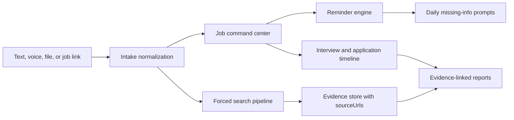

# OfferPilot Architecture

OfferPilot is an evidence-first job search command center. It helps candidates turn job links, resumes, interview notes, voice memos, uploaded files, and free-form text into a structured application workspace where every research report keeps its `sourceUrls`.

The repository includes `assets/architecture.svg` and `assets/social-card.svg` as lightweight visual assets for the README, documentation, and launch previews.

The product should feel like an operating room for job search decisions: fewer vague summaries, more traceable facts, reminders, and next actions.

## Product Principles

- Evidence first: important claims in generated reports must map back to `sourceUrls`.
- Forced search: job-link analysis must run external search before producing company, role, interview, or compensation research.
- Multi-modal intake: text, voice, files, and URLs are first-class inputs.
- Daily memory: OfferPilot should remind users to fill gaps that affect next actions, interview preparation, or long-term review.
- Privacy by default: resumes, interview notes, voice transcripts, and application history are sensitive user data.
- Human control: the system can prepare, compare, and remind, but users make the final career decisions.

## High-Level Flow

1. Intake receives a job link, pasted text, uploaded resume, uploaded notes, or voice recording.
2. Normalization extracts structured entities such as company, role, location, stage, dates, resume version, interviewers, and missing fields.
3. Job records store the canonical state of each opportunity.
4. Forced search gathers external evidence for job links and company research.
5. Evidence processing deduplicates, scores, and links findings to `sourceUrls`.
6. Report generation separates sourced facts, user-provided context, and model inferences.
7. Daily reminders ask for only the information that changes next actions or improves later review.
8. Daily intelligence workers refresh public interview signals and label them by company-scale bucket.

## Core Components

### Intake

The intake layer accepts four input modes:

- Text: pasted job descriptions, notes, recruiter messages, and quick updates.
- Voice: spoken updates that become transcripts before extraction.
- File: resumes, interview notes, offer letters, screenshots, and exported documents.
- Link: job posts from Boss Zhipin or other hiring platforms.

Each intake event should preserve the original artifact, extracted fields, timestamps, and user-confirmed corrections.

The current MVP runs job-link intake and interview-artifact intake end to end. Job links create applications and source-backed reports. Interview recordings or typed notes create completed `Interview` records with transcript text, extracted questions, a single-interview summary, and next-focus items through the mock transcription and analyzer providers.

### Job Command Center

The command center is the canonical workspace for opportunities. A job record should track:

- Company, role, platform, location, work mode, and job link.
- Application stage, last contact date, next action, and reminder priority.
- Resume version and cover letter or message draft used for the role.
- Interview schedule, interview notes, follow-up tasks, and decision status.
- Evidence reports with `sourceUrls`.

### Forced Search Pipeline

Forced search is the center of the evidence-first model. When a user submits a job link or asks for company or role research, OfferPilot should not rely on internal memory alone.

The pipeline should:

1. Parse the input link and extract candidate facts from the page or pasted text.
2. Generate search queries for company, role, interview experience, platform listing, and recent public signals.
3. Run external search providers.
4. Fetch or inspect result snippets and pages where allowed.
5. Deduplicate overlapping results.
6. Score source quality, freshness, and relevance.
7. Produce evidence items that each retain a `sourceUrl`.
8. Generate a report that clearly labels sourced facts, user-provided facts, and inferences.

### Reminder Engine

Daily reminders should be concise and useful. A reminder is worth showing when the missing information:

- Changes the next action, such as sending a follow-up or preparing for an interview.
- Will likely be forgotten within 24 hours, such as phone-screen details.
- Improves long-term statistics, such as rejection reasons or resume version performance.
- Blocks an evidence report, such as a missing company name or job link.

The system should avoid nagging users for low-value fields.

### Daily Intelligence

Daily intelligence is scheduled forced search. It should send narrow workers to public sources, retain source URLs, and label findings by company-scale bucket such as 国央企、大厂、中厂、小厂, or `unknown`.

The current MVP uses deterministic fixtures to show the workflow without pretending to collect live hiring intelligence. Production workers should cover official pages, job boards, community interview reports, news, and social sources where allowed. Social findings should be treated as candidate-reported signals that need corroboration.

Manager and GD information should be represented as interview process signals, not as private-person lookup. Public manager context may be shown only when explicit source URLs support it.

### Evidence Store

OfferPilot should store evidence separately from generated prose. This makes reports auditable and allows the user interface to show where a claim came from.

Suggested evidence fields:

- `id`
- `sourceUrl`
- `sourceTitle`
- `sourceType`
- `retrievedAt`
- `publishedAt`
- `freshnessScore`
- `qualityScore`
- `claim`
- `quoteOrSnippet`
- `usedInReportSections`

### Reports

Reports should be compact, decision-oriented, and linked to evidence. A report can include:

- Role summary.
- Company and team signals.
- Match against the user's resume.
- Interview preparation topics.
- Risks and unknowns.
- Follow-up questions.
- `sourceUrls` used to produce the report.

If a claim has no source, the report should label it as an inference or omit it.

Interview summaries are separate from public evidence reports. They can use private transcript context, but they should not present transcript-only observations as external facts or place them inside `sourceUrls`.

## Suggested Data Model

OfferPilot can start with a small relational model:

- `users`: account, locale, privacy settings, reminder preferences.
- `intake_events`: raw input metadata and extracted fields.
- `job_opportunities`: canonical job records.
- `application_events`: application, recruiter contact, interview, offer, rejection, and follow-up events.
- `artifacts`: resumes, notes, files, transcripts, and parsed documents.
- `evidence_sources`: normalized external sources with URLs and scores.
- `evidence_claims`: claim-level evidence linked to source records.
- `reports`: generated summaries and structured report JSON.
- `reminders`: missing-info prompts, schedule, status, and resolution.

## Agent Roles

OfferPilot may use multiple agent-like workers, but each worker should have a narrow contract:

- Intake Worker: parses text, voice transcripts, files, and links into structured fields.
- Search Worker: performs forced search and returns candidate sources.
- Evidence Judge: scores relevance, freshness, and source quality.
- Report Worker: writes concise summaries with `sourceUrls`.
- Reminder Worker: asks for missing data that matters.
- Privacy Guard: redacts sensitive fields before logs, demos, or third-party calls.

## Non-Goals

- OfferPilot is not an auto-apply bot.
- OfferPilot is not a resume spam tool.
- OfferPilot should not scrape sites where doing so violates terms or robots policies.
- OfferPilot should not invent interview experiences, compensation, or company facts without evidence.

## Implementation Notes

The architecture should stay provider-neutral. Search, speech-to-text, file parsing, and LLM providers can be swapped as long as their outputs preserve evidence links, privacy controls, and user-visible provenance.

## Visual Assets

- `assets/architecture.svg`: high-level system diagram for README, docs, and launch pages. It highlights the flow from multi-modal intake to normalization, forced search agents, evidence storage with `sourceUrls`, evidence-linked reports, reminders, and the interview feedback loop.
- `assets/social-card.svg`: social preview card for GitHub and project sharing. It presents OfferPilot as an evidence-first job search command center with the key product loop: intake, forced search, `sourceUrls`, reminders, and interview preparation.
